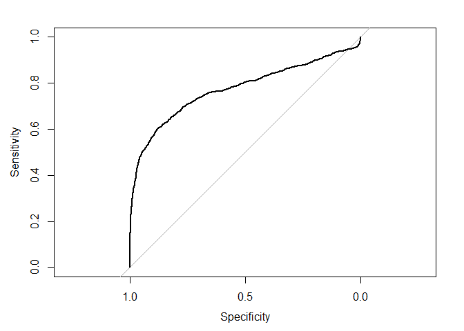
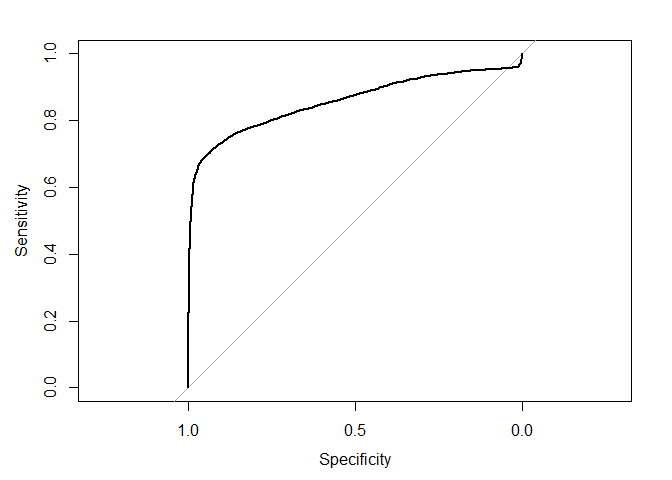
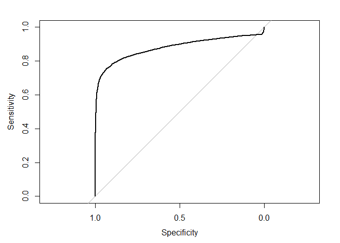
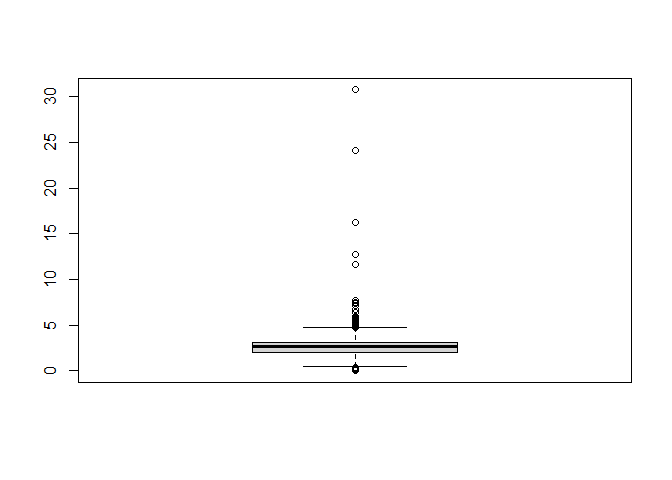
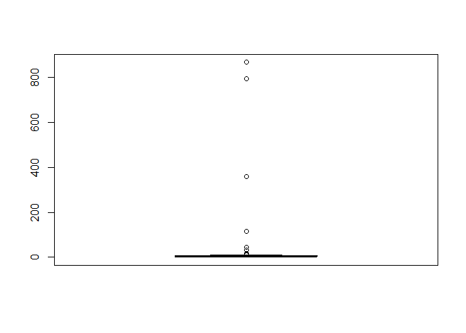

Proyecto 3 Data Mining
================
Diego Aguilar Dañobeitía
25/6/2021

## Cargar las librerías

Primero, se procede a cargar las librerías necesarias:

``` r
library(tidyverse)
```

    ## Warning: package 'tidyverse' was built under R version 4.0.5

    ## -- Attaching packages --------------------------------------- tidyverse 1.3.0 --

    ## v ggplot2 3.3.3     v purrr   0.3.4
    ## v tibble  3.1.0     v dplyr   1.0.5
    ## v tidyr   1.1.3     v stringr 1.4.0
    ## v readr   1.4.0     v forcats 0.5.1

    ## Warning: package 'ggplot2' was built under R version 4.0.5

    ## Warning: package 'tibble' was built under R version 4.0.5

    ## Warning: package 'tidyr' was built under R version 4.0.5

    ## Warning: package 'readr' was built under R version 4.0.5

    ## Warning: package 'purrr' was built under R version 4.0.5

    ## Warning: package 'dplyr' was built under R version 4.0.5

    ## Warning: package 'stringr' was built under R version 4.0.5

    ## Warning: package 'forcats' was built under R version 4.0.5

    ## -- Conflicts ------------------------------------------ tidyverse_conflicts() --
    ## x dplyr::filter() masks stats::filter()
    ## x dplyr::lag()    masks stats::lag()

``` r
library(pROC)
```

    ## Warning: package 'pROC' was built under R version 4.0.5

    ## Type 'citation("pROC")' for a citation.

    ## 
    ## Attaching package: 'pROC'

    ## The following objects are masked from 'package:stats':
    ## 
    ##     cov, smooth, var

``` r
library(dplyr)

library(aplpack)
```

## Cargar los datos

Luego, una de las primeras cosas que se tiene que hacer para iniciar el
análisis de los datos es cargar el archivo que los contiene, lo que se
guardará en la variable “data”:

``` r
setwd("D:/Documentos/Files & Stuff/U/Data Mining/Proyecto-3")

data <- readRDS("endurance.rds")

glimpse(data)
```

    ## Rows: 167,615
    ## Columns: 16
    ## $ id                   <int> 1, 2, 3, 4, 5, 6, 7, 8, 9, 10, 11, 12, 13, 14, 15~
    ## $ type                 <chr> "Ride", "Ride", "Ride", "Ride", "Ride", "Ride", "~
    ## $ athlete              <dbl> 13279977, 13279977, 13279977, 13279977, 13279977,~
    ## $ calories             <dbl> 520.9, 538.0, 741.6, 314.5, 696.5, 109.1, 510.9, ~
    ## $ distance             <dbl> 13130.5, 12938.7, 17515.7, 7931.4, 17072.7, 3195.~
    ## $ elev_low             <chr> "337.3", "338.5", "301.6", "339.2", "336.2", "333~
    ## $ records              <chr> "0", "1", "0", "0", "1", "0", "0", "1", "1", "0",~
    ## $ elev_high            <chr> "375.6", "477", "377", "389.7", "389.4", "369.1",~
    ## $ max_speed            <chr> "10.5", "11.4", "11.6", "10.2", "14.2", "6.8", "1~
    ## $ device_name          <chr> "Strava iPhone App", "Strava iPhone App", "Strava~
    ## $ moving_time          <dbl> 3908, 3791, 3837, 2280, 4188, 1237, 2873, 2439, 5~
    ## $ elapsed_time         <dbl> 4326, 4975, 4510, 2521, 4473, 4166, 3390, 2759, 5~
    ## $ average_speed        <chr> "3.36", "3.413", "4.565", "3.479", "4.077", "2.58~
    ## $ has_heartrate        <chr> "FALSE", "FALSE", "FALSE", "FALSE", "FALSE", "FAL~
    ## $ start_date_local     <dttm> 2015-10-25 07:33:45, 2015-10-23 06:44:01, 2015-1~
    ## $ total_elevation_gain <dbl> 206.0, 287.9, 309.1, 156.4, 268.8, 36.3, 192.6, 1~

Por lo que se puede observar, existen 167615 datos con 16 atributos.

Cabe destacar además que estos datos corresponden a mediciones de
actividades deportivas de deportistas de resistencia, hechas a través de
dispositivos digitales.

## Pre procesamiento de los datos

Se procede a limpiar los datos en base a los objetivos: como objetivo
primario, diferenciar las actividades que son llevadas a cabo a pie
versus las que son llevadas a cabo en bicicleta mediante las demás
variables; como objetivo secundario, determinar las actividades que
fueron registradas erróneamente por el usuario.

### Eliminación de entidades duplicadas

Primero, se procede a eliminar entidades que poseen los mismos valores
para cada variable entre sí:

``` r
dataunique <- unique(data)

glimpse(dataunique)
```

    ## Rows: 167,615
    ## Columns: 16
    ## $ id                   <int> 1, 2, 3, 4, 5, 6, 7, 8, 9, 10, 11, 12, 13, 14, 15~
    ## $ type                 <chr> "Ride", "Ride", "Ride", "Ride", "Ride", "Ride", "~
    ## $ athlete              <dbl> 13279977, 13279977, 13279977, 13279977, 13279977,~
    ## $ calories             <dbl> 520.9, 538.0, 741.6, 314.5, 696.5, 109.1, 510.9, ~
    ## $ distance             <dbl> 13130.5, 12938.7, 17515.7, 7931.4, 17072.7, 3195.~
    ## $ elev_low             <chr> "337.3", "338.5", "301.6", "339.2", "336.2", "333~
    ## $ records              <chr> "0", "1", "0", "0", "1", "0", "0", "1", "1", "0",~
    ## $ elev_high            <chr> "375.6", "477", "377", "389.7", "389.4", "369.1",~
    ## $ max_speed            <chr> "10.5", "11.4", "11.6", "10.2", "14.2", "6.8", "1~
    ## $ device_name          <chr> "Strava iPhone App", "Strava iPhone App", "Strava~
    ## $ moving_time          <dbl> 3908, 3791, 3837, 2280, 4188, 1237, 2873, 2439, 5~
    ## $ elapsed_time         <dbl> 4326, 4975, 4510, 2521, 4473, 4166, 3390, 2759, 5~
    ## $ average_speed        <chr> "3.36", "3.413", "4.565", "3.479", "4.077", "2.58~
    ## $ has_heartrate        <chr> "FALSE", "FALSE", "FALSE", "FALSE", "FALSE", "FAL~
    ## $ start_date_local     <dttm> 2015-10-25 07:33:45, 2015-10-23 06:44:01, 2015-1~
    ## $ total_elevation_gain <dbl> 206.0, 287.9, 309.1, 156.4, 268.8, 36.3, 192.6, 1~

Se observa que no disminuyó el número de entidades, por lo que no
existen entidades duplicadas.

### Eliminación de entidades con valores faltantes

Luego se necesita limpiar las entidades que tienen valores faltantes
(NA) de los datos:

``` r
dataclean <- na.omit(dataunique)

glimpse(dataclean)
```

    ## Rows: 151,990
    ## Columns: 16
    ## $ id                   <int> 1, 2, 3, 4, 5, 6, 7, 8, 9, 10, 11, 12, 13, 14, 15~
    ## $ type                 <chr> "Ride", "Ride", "Ride", "Ride", "Ride", "Ride", "~
    ## $ athlete              <dbl> 13279977, 13279977, 13279977, 13279977, 13279977,~
    ## $ calories             <dbl> 520.9, 538.0, 741.6, 314.5, 696.5, 109.1, 510.9, ~
    ## $ distance             <dbl> 13130.5, 12938.7, 17515.7, 7931.4, 17072.7, 3195.~
    ## $ elev_low             <chr> "337.3", "338.5", "301.6", "339.2", "336.2", "333~
    ## $ records              <chr> "0", "1", "0", "0", "1", "0", "0", "1", "1", "0",~
    ## $ elev_high            <chr> "375.6", "477", "377", "389.7", "389.4", "369.1",~
    ## $ max_speed            <chr> "10.5", "11.4", "11.6", "10.2", "14.2", "6.8", "1~
    ## $ device_name          <chr> "Strava iPhone App", "Strava iPhone App", "Strava~
    ## $ moving_time          <dbl> 3908, 3791, 3837, 2280, 4188, 1237, 2873, 2439, 5~
    ## $ elapsed_time         <dbl> 4326, 4975, 4510, 2521, 4473, 4166, 3390, 2759, 5~
    ## $ average_speed        <chr> "3.36", "3.413", "4.565", "3.479", "4.077", "2.58~
    ## $ has_heartrate        <chr> "FALSE", "FALSE", "FALSE", "FALSE", "FALSE", "FAL~
    ## $ start_date_local     <dttm> 2015-10-25 07:33:45, 2015-10-23 06:44:01, 2015-1~
    ## $ total_elevation_gain <dbl> 206.0, 287.9, 309.1, 156.4, 268.8, 36.3, 192.6, 1~

Se observa que ahora existen 151990 entidades, un poco menos que las
anteriores.

### Reducción de dimensionalidad

Después, según lo anterior, las únicas variables que se llegarían a usar
son las variables de “type”, “distance”, y “average\_speed”.

``` r
datadim <- dataclean[c("type", "distance", "average_speed")]

glimpse(datadim)
```

    ## Rows: 151,990
    ## Columns: 3
    ## $ type          <chr> "Ride", "Ride", "Ride", "Ride", "Ride", "Ride", "Ride", ~
    ## $ distance      <dbl> 13130.5, 12938.7, 17515.7, 7931.4, 17072.7, 3195.0, 1253~
    ## $ average_speed <chr> "3.36", "3.413", "4.565", "3.479", "4.077", "2.583", "4.~

Se observa que ahora se cuenta con los mismos 151990 datos, pero ahora
con sólo 3 variables, que son las que se necesitan.

### Revisión de estados de la variable “type”

Luego, se van a revisar los valores o estados posibles de esta variable.

``` r
typevalues <- unique(datadim$type)

print(typevalues)
```

    ## [1] "Ride"      "Run"       "Walk"      "Hike"      "EBikeRide"

Se observa que existen los estados de “Ride”, “Run”, “Walk”, “Hike” y
“EBikeRide”.

### Eliminación de los valores “0” de las variables

En este caso, se considera que las mediciones con valores iguales a 0 no
son mediciones válidas, por lo que se eliminarán:

``` r
datanozero <- datadim[apply(datadim, 1, function(row) all(row != 0 )),]

glimpse(datanozero)
```

    ## Rows: 148,409
    ## Columns: 3
    ## $ type          <chr> "Ride", "Ride", "Ride", "Ride", "Ride", "Ride", "Ride", ~
    ## $ distance      <dbl> 13130.5, 12938.7, 17515.7, 7931.4, 17072.7, 3195.0, 1253~
    ## $ average_speed <chr> "3.36", "3.413", "4.565", "3.479", "4.077", "2.583", "4.~

### Reducción de estados de la variable “type”

Ahora, se van a agrupar los valores de esta variable en 2 valores
posibles y distintos (variable binaria): “0”, que incluye a los valores
correspondientes a las actividades a pie; “Walk”, “Run” y “Hike”; y “1”,
que inclutye a los valores correspondientes a las actividades en
bicicleta: “Ride” y “EBikeRide”.

``` r
datadim$type[datadim$type == "Walk"] <- 0

datadim$type[datadim$type == "Run"] <- 0

datadim$type[datadim$type == "Hike"] <- 0

datadim$type[datadim$type == "Ride"] <- 1

datadim$type[datadim$type == "EBikeRide"] <- 1

datadim$type <- as.integer(datadim$type)

typevalues2 <- unique(datadim$type)

print(typevalues2)
```

    ## [1] 1 0

### Conversión de la variable “average\_speed” a double

Luego, se va a convertir dicha variable del tipo character al tipo
double.

``` r
datadim$average_speed <- as.double(datadim$average_speed)

glimpse(datadim)
```

    ## Rows: 151,990
    ## Columns: 3
    ## $ type          <int> 1, 1, 1, 1, 1, 1, 1, 1, 1, 1, 1, 1, 1, 1, 1, 1, 1, 1, 1,~
    ## $ distance      <dbl> 13130.5, 12938.7, 17515.7, 7931.4, 17072.7, 3195.0, 1253~
    ## $ average_speed <dbl> 3.360, 3.413, 4.565, 3.479, 4.077, 2.583, 4.363, 3.025, ~

### Sampleo

Por último, para esta fase, se va a realizar un sampleo de los datos
para hacer posible los procedimientos de análsis posteriores sin
problemas:

``` r
set.seed(1)

datared <- sample_n(datadim, 10000)

glimpse(datared)
```

    ## Rows: 10,000
    ## Columns: 3
    ## $ type          <int> 1, 1, 1, 1, 1, 1, 1, 1, 1, 0, 0, 1, 1, 1, 1, 0, 0, 1, 1,~
    ## $ distance      <dbl> 0.0, 88.9, 29784.9, 12061.9, 14797.1, 33506.6, 42471.7, ~
    ## $ average_speed <dbl> 0.000, 3.865, 3.562, 4.523, 3.033, 4.938, 6.916, 5.375, ~

## Análisis de los datos

Ya que se han limpiado y ordenado los datos de forma correcta, se
procede al análisis de estos para resolver la problemática planteada en
este caso.

### Objetivo 1

Para distinguir si una actividad fue realizada a pie o en bicicleta, se
va a realizar un análisis de clasificación mediante una regresión
logística.

#### Regresión logística utilizando “distance”

Se realizará un primer modelo mediante una función logística simple,
utilizando la variable “distance”:

``` r
logisticmodel <- glm(type ~ distance, datared, family = "binomial")

summary(logisticmodel)
```

    ## 
    ## Call:
    ## glm(formula = type ~ distance, family = "binomial", data = datared)
    ## 
    ## Deviance Residuals: 
    ##     Min       1Q   Median       3Q      Max  
    ## -6.1182  -1.0586   0.3288   0.9198   1.5038  
    ## 
    ## Coefficients:
    ##               Estimate Std. Error z value Pr(>|z|)    
    ## (Intercept) -7.408e-01  3.886e-02  -19.07   <2e-16 ***
    ## distance     8.931e-05  2.581e-06   34.60   <2e-16 ***
    ## ---
    ## Signif. codes:  0 '***' 0.001 '**' 0.01 '*' 0.05 '.' 0.1 ' ' 1
    ## 
    ## (Dispersion parameter for binomial family taken to be 1)
    ## 
    ##     Null deviance: 12841  on 9999  degrees of freedom
    ## Residual deviance: 10328  on 9998  degrees of freedom
    ## AIC: 10332
    ## 
    ## Number of Fisher Scoring iterations: 6

Luego, se va a verificar la bondad del modelo para ver si su poder
predictivo es significativo:

``` r
bond <- predict(logisticmodel, type = c("response"))

datalogdistance <- datared

datalogdistance$bond <- bond

curva_roc <- roc(type ~ bond, data = datalogdistance)
```

    ## Setting levels: control = 0, case = 1

    ## Setting direction: controls < cases

``` r
plot(curva_roc)
```

<!-- -->

``` r
auc(curva_roc)
```

    ## Area under the curve: 0.7719

Se observa que el área bajo la curva es de 0.7719, por lo que se va a
realizar una regresión logística con la variable “average\_speed” para
ver si se obtiene un mejor modelo.

#### Regresión logística utilizando “average\_speed”

``` r
logisticmodel2 <- glm(type ~ average_speed, datared, family = "binomial")
```

    ## Warning: glm.fit: fitted probabilities numerically 0 or 1 occurred

``` r
summary(logisticmodel2)
```

    ## 
    ## Call:
    ## glm(formula = type ~ average_speed, family = "binomial", data = datared)
    ## 
    ## Deviance Residuals: 
    ##     Min       1Q   Median       3Q      Max  
    ## -6.9215  -0.9195   0.2787   0.7472   2.2412  
    ## 
    ## Coefficients:
    ##               Estimate Std. Error z value Pr(>|z|)    
    ## (Intercept)   -2.42676    0.06905  -35.14   <2e-16 ***
    ## average_speed  0.85778    0.01998   42.93   <2e-16 ***
    ## ---
    ## Signif. codes:  0 '***' 0.001 '**' 0.01 '*' 0.05 '.' 0.1 ' ' 1
    ## 
    ## (Dispersion parameter for binomial family taken to be 1)
    ## 
    ##     Null deviance: 12840.5  on 9999  degrees of freedom
    ## Residual deviance:  9318.9  on 9998  degrees of freedom
    ## AIC: 9322.9
    ## 
    ## Number of Fisher Scoring iterations: 7

``` r
bond2 <- predict(logisticmodel2, type = c("response"))

datalogspeed <- datared

datalogspeed$bond2 <- bond2

curva_roc2 <- roc(type ~ bond2, data = datalogspeed)
```

    ## Setting levels: control = 0, case = 1

    ## Setting direction: controls < cases

``` r
plot(curva_roc2)
```

<!-- -->

``` r
auc(curva_roc2)
```

    ## Area under the curve: 0.8548

Se observa que el área bajo la curva es de 0.8548, mejor que el modelo
anterior.

#### Regresión logística utilizando “distance” y “average\_speed”

Ahora se va a realizar una regresión logística con ambas variables
señaladas:

``` r
logisticmodelmulti <- glm(type ~ ., datared, family = "binomial")
```

    ## Warning: glm.fit: fitted probabilities numerically 0 or 1 occurred

``` r
summary(logisticmodelmulti)
```

    ## 
    ## Call:
    ## glm(formula = type ~ ., family = "binomial", data = datared)
    ## 
    ## Deviance Residuals: 
    ##     Min       1Q   Median       3Q      Max  
    ## -6.2736  -0.9162   0.1753   0.7026   2.3131  
    ## 
    ## Coefficients:
    ##                 Estimate Std. Error z value Pr(>|z|)    
    ## (Intercept)   -2.604e+00  7.435e-02  -35.02   <2e-16 ***
    ## distance       5.445e-05  2.887e-06   18.86   <2e-16 ***
    ## average_speed  6.801e-01  2.134e-02   31.87   <2e-16 ***
    ## ---
    ## Signif. codes:  0 '***' 0.001 '**' 0.01 '*' 0.05 '.' 0.1 ' ' 1
    ## 
    ## (Dispersion parameter for binomial family taken to be 1)
    ## 
    ##     Null deviance: 12840.5  on 9999  degrees of freedom
    ## Residual deviance:  8855.8  on 9997  degrees of freedom
    ## AIC: 8861.8
    ## 
    ## Number of Fisher Scoring iterations: 7

``` r
bondmulti <- predict(logisticmodelmulti, type = c("response"))

datalogmulti <- datared

datalogmulti$bondmulti <- bondmulti

curva_rocmulti <- roc(type ~ bondmulti, data = datalogmulti)
```

    ## Setting levels: control = 0, case = 1

    ## Setting direction: controls < cases

``` r
plot(curva_rocmulti)
```

<!-- -->

``` r
auc(curva_rocmulti)
```

    ## Area under the curve: 0.8761

Se observa que el área bajo la curva es más alta que ambas regresiones
anteriores (0.8761), por lo que las variables “distance” y
“average\_speed” son mejores para el modelo en su conjunto.

### Objetivo 2

Para identificar las variables que fueron registradas erróneamente por
los usuarios, se van a determinar los valores atípicos para subsets de
datos según si las actividades fueron registradas a pie o en bicicleta,
para la variable “average\_speed”, que por si sola es un mejor predictor
que la variable “distance”. Una vez determinados estos valores, se van a
separar del resto y se van a imprimir en pantalla.

#### Separación de actividades en distintos dataframes según tipo

Se procederá a separar los datos en dos dataframes para analizarlos
separadamente según el tipo ingresado por el usuario.

``` r
datafoot <- datared %>% filter(type == 0)

databike <- datared %>% filter(type == 1)

glimpse(datafoot)
```

    ## Rows: 3,415
    ## Columns: 3
    ## $ type          <int> 0, 0, 0, 0, 0, 0, 0, 0, 0, 0, 0, 0, 0, 0, 0, 0, 0, 0, 0,~
    ## $ distance      <dbl> 9501.9, 8250.8, 4736.6, 2054.0, 9502.8, 4695.8, 9781.9, ~
    ## $ average_speed <dbl> 1.063, 3.052, 3.644, 1.969, 3.690, 0.976, 2.630, 3.159, ~

``` r
glimpse(databike)
```

    ## Rows: 6,585
    ## Columns: 3
    ## $ type          <int> 1, 1, 1, 1, 1, 1, 1, 1, 1, 1, 1, 1, 1, 1, 1, 1, 1, 1, 1,~
    ## $ distance      <dbl> 0.0, 88.9, 29784.9, 12061.9, 14797.1, 33506.6, 42471.7, ~
    ## $ average_speed <dbl> 0.000, 3.865, 3.562, 4.523, 3.033, 4.938, 6.916, 5.375, ~

#### Muestra gráfica de la existencia de valores atípicos

``` r
boxplot(datafoot$average_speed)
```

<!-- -->

Se ve que las actividades a pie presentan varios valores atípicos en los
valores mayores, que por conclusión corresponderían a actividades en
bicicleta registradas erróneamente.

``` r
boxplot(databike$average_speed)
```

<!-- -->

Se observa que los valores atípicos aquí se encuentran en los valores
mayores también, pero estos, lógicamente, no pueden ser actividades a
pie mal registradas (las que deberían tener menor velocidad promedio),
por lo que sólo se asumirán como variables atípicas bien registradas.

#### Determinación de actividades mal ingresadas

##### Actividades erróneamente ingresadas como a pie

Las actividades que erróneamente fueron ingresadas como realizadas a pie
(que en realidad fueron a bicicleta) probablemente corresponden a las
que tienen las siguientes mediciones:

``` r
footout <- boxplot.stats(datafoot$average_speed)$out

footoutdf <- as.data.frame(footout)

footoutupper <- footoutdf %>% filter(footoutdf$footout > median(footoutdf$footout))

print(footoutupper)
```

    ##    footout
    ## 1    7.694
    ## 2    5.489
    ## 3    5.817
    ## 4    5.298
    ## 5    5.910
    ## 6    5.726
    ## 7    4.895
    ## 8   16.290
    ## 9    5.411
    ## 10   6.687
    ## 11   6.676
    ## 12   4.864
    ## 13   6.409
    ## 14  30.754
    ## 15   4.863
    ## 16   5.522
    ## 17   5.061
    ## 18   5.916
    ## 19   5.046
    ## 20   5.706
    ## 21   7.327
    ## 22   4.979
    ## 23  11.646
    ## 24   5.393
    ## 25   7.125
    ## 26   5.277
    ## 27   4.883
    ## 28  24.088
    ## 29   5.063
    ## 30   4.942
    ## 31  12.772
    ## 32   5.669
    ## 33   5.105
    ## 34   5.178
    ## 35   7.460

##### Actividades erróneamente ingresadas como en bicicleta

Debido a la carencia de valores atípicos en el extremo de los valores
menores, con el modelo actual no se pueden determinar actividades
ingresadas como realizadas en bicicleta mientras fueron realizadas a
pie. Esto se puede explicar a que es posible ir a una velocidad promedio
similar en bicicleta a la velocidad promedio de las actividades a pie,
pero la situación contraria es muy poco probable.

## Conclusiones

Para predecir si una actividad corresponde a una realizada a pie o en
bicicleta, tomando variables aparte de la variable “type”, se puede
utilizar tanto la variable “distance” como la variable “average\_speed”,
obteniendo mejores resultados mediante esta última. Al tratar de
utilizar ambas variables, se obtiene un poder predictivo levemente
superior, por lo que es mejor utilizarlas en conjunto al momento de
predecir el tipo de una actividad sin conocer directamente el tipo
ingresado. Dado que las variables señaladas anteriormente son buenos
predictores de si una actividad pertenece a un tipo u otro, se utiliza
la mejor predictora de ambas para determinar valores atípicos. Estos
podrían corresponder a valores mal ingresados en el caso de los
registros a pie, pero no así para los registros en bicicleta. La falta
de capacidad para predecir valores mal ingresados en bicicleta puede
venir dado ya sea por la naturaleza del problema, o por el modelo
utilizado.
